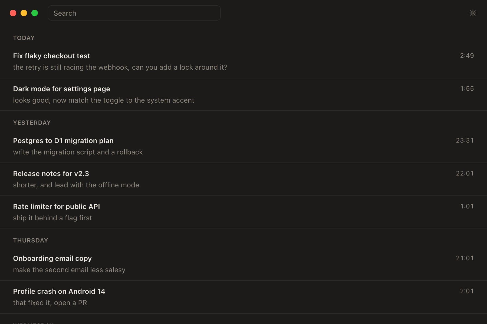
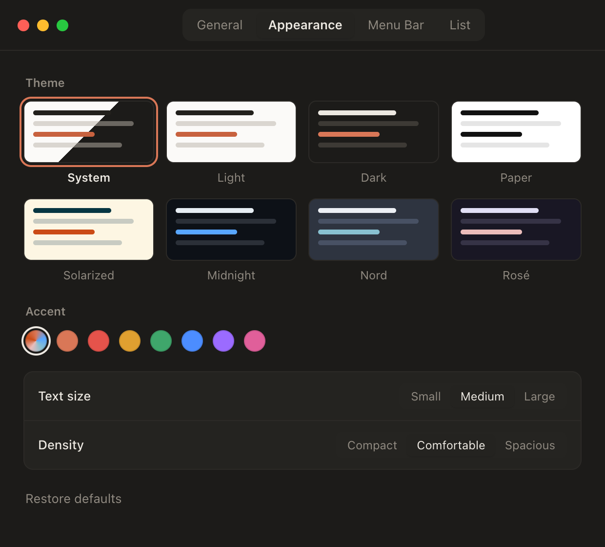
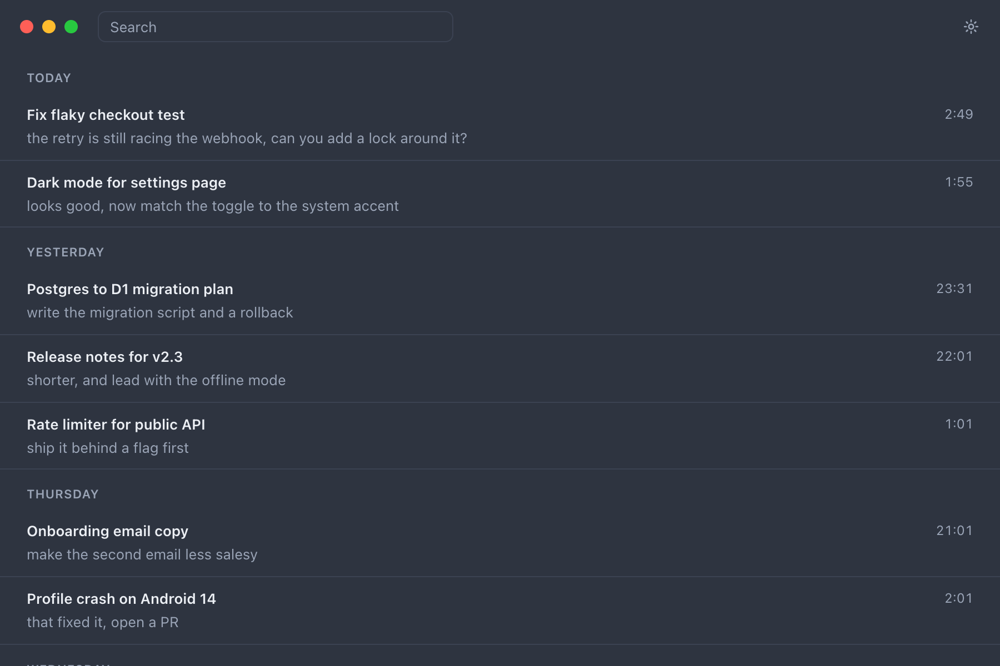

<p align="center">
  
</p>

<h1 align="center">Claude Sessions</h1>

<p align="center">
  Every Claude Code session from every folder, newest first.<br />
  Click one and it reopens in a new terminal window, in the right folder, with the whole conversation back.
</p>

<p align="center">
  <a href="https://sessions.aryakesarwani.tech"><b>Website &amp; live demo</b></a> ·
  <a href="https://github.com/AryaKesharwani/claude-sessions/releases/latest/download/Claude-Sessions-macOS-arm64.zip"><b>Download for Mac (Apple Silicon)</b></a> ·
  <a href="#the-cs-cli">CLI</a>
</p>

<p align="center">
  
</p>

> Screenshots use made-up sessions. Not affiliated with Anthropic.

---

## The problem

I run a lot of Claude Code sessions at once: a bug fix in one repo, a refactor in another, a quick question from my home folder. Then I close the terminal, and the next day I can't find any of them.

They aren't actually gone. Digging in turned up three things:

1. **Every session is saved.** Claude Code writes each one to `~/.claude/projects/<encoded-folder>/<session-id>.jsonl`. Each file records the working directory, git branch, every message and an auto-generated title.
2. **`claude --resume` only lists sessions for the current folder.** If you don't remember where you started a session, you have to `cd` around until it shows up.
3. **Old sessions get deleted.** Claude Code removes session files after 30 days by default (`cleanupPeriodDays` in `~/.claude/settings.json`).

## The fix

Two pieces that share one index:

- **`cs`**, a single-file Python CLI with no dependencies. It reads every session file, lists them newest first, and resumes any of them from anywhere by changing into the session's original folder and running `claude --resume <id>`. It can also back sessions up so cleanup can't delete them.
- **Claude Sessions**, a small macOS app ([Tauri 2](https://tauri.app), about 6 MB) with a minimal timeline window and a menu bar dropdown. Click a session and it opens in a new Terminal, iTerm2 or Ghostty window.

## Features

- **One timeline.** Newest at the top, oldest at the bottom, grouped by Today, Yesterday and earlier dates. You never pick a folder.
- **One click opens a new terminal window**, titled with the session name.
- **Menu bar dropdown** with your 5–20 most recent sessions, so you can open one without the main window. Closing the window keeps the app in the menu bar.
- **Side by side.** Tile every open terminal window into a grid on the current screen (respects the menu bar, notch and Dock).
- **Search** by title, message text or folder. Enter opens the top result; ⌘F focuses search, Esc clears it.
- **Themes:** System, Light, Dark, Paper, Solarized, Midnight, Nord, Rosé, plus accent colours, three text sizes and three densities.
- **Backups past 30 days.** `cs backup` archives session files; archived sessions show up in the list and are restored automatically when opened.
- **Optional AI recaps.** `cs summary` asks Claude Haiku for a 2–3 sentence recap of a session and caches it.
- **Your setup:** Terminal, iTerm2 or Ghostty, plus extra arguments for every resume (for example `--model opus`).
- **Local only.** It reads files on your Mac and never edits Claude Code's session files.

<p align="center">
  
  
</p>

## Install

### The app (Apple Silicon Mac)

1. Download **[Claude-Sessions-macOS-arm64.zip](https://github.com/AryaKesharwani/claude-sessions/releases/latest/download/Claude-Sessions-macOS-arm64.zip)** and unzip it.
2. Move **Claude Sessions.app** to `/Applications`.
3. The app isn't signed with an Apple developer certificate yet, so macOS blocks the first launch. Clear the quarantine flag once:
   ```sh
   xattr -dr com.apple.quarantine "/Applications/Claude Sessions.app"
   ```
4. Open it. The first time you click a session, macOS asks whether Claude Sessions may control Terminal. Click **Allow**; that's how it opens windows. (You can change this later in System Settings → Privacy & Security → Automation.)

Requirements: macOS 11+, [Claude Code](https://docs.claude.com/en/docs/claude-code) installed with `claude` on your login shell's `PATH`, and `/usr/bin/python3` (part of Apple's command line tools).

### Just the CLI (macOS or Linux)

```sh
mkdir -p ~/.local/bin
curl -fsSL https://raw.githubusercontent.com/AryaKesharwani/claude-sessions/main/cs.py -o ~/.local/bin/cs
chmod +x ~/.local/bin/cs
cs
```

Make sure `~/.local/bin` is on your `PATH`. If [fzf](https://github.com/junegunn/fzf) is installed, the picker uses it.

### Build the app from source

```sh
git clone https://github.com/AryaKesharwani/claude-sessions
cd claude-sessions/app
pnpm install
pnpm tauri build
# → src-tauri/target/release/bundle/macos/Claude Sessions.app
```

Needs Rust 1.77+ and Node 18+. This is also how to get an Intel build. For live reload while hacking, run `pnpm tauri dev`.

## The `cs` CLI

| Command | What it does |
| --- | --- |
| `cs` | Interactive picker. Type a number to resume, or words to narrow the list. |
| `cs ls [words] [-n 25] [--here] [--json]` | List sessions newest first. `--here` limits to the current folder; `--json` prints everything the index knows. |
| `cs r <number\|id> [--claude-args "…"]` | Resume by list number or id prefix, in the session's original folder. |
| `cs show <number\|id> [-n 8]` | Print the last messages you sent in a session. |
| `cs summary <number\|id>` | Write and cache a short AI recap (`claude -p --model haiku`). |
| `cs pin <number\|id>` | Pin or unpin a session to the top of `cs ls`. |
| `cs backup [-q]` | Copy new or changed session files into `~/.claude-sessions/archive`. |

Example:

```text
$ cs ls checkout -n 2
  1  Fix flaky checkout test
     ~/code/shop-api (fix/checkout-race)  12m ago · 3f9c2a1b
  2  Rate limiter for public API
     ~/code/shop-api (main)  1d ago · 8be41d07

$ cs r 1
cd ~/code/shop-api && claude --resume 3f9c2a1b-…
```

### Never lose a session again

Either back up automatically when each session ends, by adding a hook to `~/.claude/settings.json`:

```json
{
  "hooks": {
    "SessionEnd": [{ "hooks": [{ "type": "command", "command": "~/.local/bin/cs backup -q" }] }]
  }
}
```

or tell Claude Code to keep sessions longer:

```json
{ "cleanupPeriodDays": 365 }
```

## Settings

Open with **⌘,**, the gear icon, or the menu bar dropdown. Changes save immediately to `~/.claude-sessions/settings.json` and apply to every window.

| Tab | Setting | Default |
| --- | --- | --- |
| General | Open sessions in Terminal / iTerm2 / Ghostty (missing apps are disabled) | Terminal |
| | Tile windows after opening | Off |
| | Extra Claude arguments | none |
| | Keep running in the menu bar when the window closes | On |
| Appearance | Theme (8) | System |
| | Accent colour | theme default |
| | Text size: small / medium / large | Medium |
| | Density: compact / comfortable / spacious | Comfortable |
| Menu Bar | Show in menu bar | On |
| | Recent sessions in menu: 5 / 10 / 15 / 20 | 10 |
| List | Second line: latest message / first message / AI summary | Latest message |
| | Show time | On |
| | Show archived sessions | On |
| | Show sessions from: all time / today / 7 / 30 / 90 days | All time |

## How it works

```
~/.claude/projects/<folder>/<id>.jsonl ─┐
~/.claude-sessions/archive/…/<id>.jsonl ┴─▶ cs.py (index, cached by size + mtime)
                                               │
                     ┌─────────────────────────┼──────────────────────────┐
                     ▼                         ▼                          ▼
                cs (terminal)        Claude Sessions.app           menu bar dropdown
                                       (Tauri, Rust + HTML)
                                               │  AppleScript / open
                                               ▼
                        new terminal window: cd <folder> && claude --resume <id>
```

- **Parsing.** Small files are read in full. For large ones (some sessions are 100 MB+) `cs` reads the first 400 lines and the last 512 KB, which is enough for the folder, the first message, the latest title and the latest message. Unparseable lines are skipped.
- **Titles.** A `/rename` title wins, then Claude Code's auto-generated title, then your first message.
- **Caching.** `~/.claude-sessions/index.json` stores each file's parsed info keyed by path, size and mtime, so a refresh of ~50 sessions takes ~30 ms.
- **Opening.** The app runs the bundled `cs.py r <id>` inside a new terminal window. That restores the file from the archive if Claude Code already deleted it, changes directory, then `exec`s `claude --resume <id>`.
- **PATH.** Mac apps launch with a bare `PATH`, so the app reads your login shell's `PATH` once at startup so it can find `claude` (nvm, Homebrew, `~/.local/bin`).
- **Tiling.** Counts visible windows of the chosen terminal and sets each window's bounds to a grid cell inside the monitor's work area. The last row stretches to fill the width.

### Files

| Path | What |
| --- | --- |
| `~/.claude/projects/*/*.jsonl` | Claude Code's session files (read only) |
| `~/.claude-sessions/index.json` | Cached index |
| `~/.claude-sessions/archive/` | `cs backup` copies |
| `~/.claude-sessions/settings.json` | App settings |
| `~/.claude-sessions/summaries.json` | Cached AI recaps |
| `~/.claude-sessions/pins.json` | Pins (CLI) |

## Privacy

Listing, searching and opening are local file reads. Nothing is sent anywhere, and there is no telemetry.

The one exception is `cs summary`, which only runs when you ask. It sends the messages *you typed* in that one session (not Claude's replies, not your files) to Claude Haiku through your own `claude` login, with tools disabled and `--no-session-persistence` so the request doesn't create a new session.

## Repository layout

```
cs.py                    the CLI, also bundled into the app
app/                     Tauri app
  src/                   UI: index.html (list), settings.html, theme.css/js
  src-tauri/src/main.rs  menus, tray, settings, terminal + tiling (AppleScript)
website/                 sessions.aryakesarwani.tech (Cloudflare Worker + D1)
  src/                   landing page and /feedback questionnaire
  worker/index.js        serves the site; POST /api/feedback stores answers in D1
  migrations/            D1 schema
  demo-shim/mock.js      fake Tauri API so the real app UI runs in the browser demo
  build.sh               landing page + app/src + mock → dist/
docs/                    README screenshots
```

### Website

```sh
cd website
npm install
npm run dev      # build + wrangler dev
npm run deploy   # build + deploy to Cloudflare Workers
npm run feedback # print questionnaire answers (needs access to the D1 database)
```

Questionnaire answers are stored in a D1 table with only the answers, a `?ref=` source tag, the visitor's country, and a salted IP hash used for rate limiting (5 per hour).

The demo on the site is the real `app/src` UI. `build.sh` copies it next to `mock.js`, which stands in for `window.__TAURI__` with made-up sessions.

## Limitations

- The download is Apple Silicon only and unsigned (no paid Apple developer account yet).
- Opening windows uses AppleScript, so the app is macOS only. The CLI works anywhere Python 3 and Claude Code do.
- Tiling works with Terminal and iTerm2, not Ghostty.
- It depends on Claude Code's session file format, which isn't a public API and may change.

## Roadmap

Tracked as [issues labelled `roadmap`](https://github.com/AryaKesharwani/claude-sessions/issues?q=is%3Aopen+label%3Aroadmap): Linux support, launch at login, more terminals (kitty, WezTerm, Warp, tmux), full-conversation search, and signed universal builds. The [questionnaire](https://sessions.aryakesarwani.tech/feedback?ref=readme) decides the order.

## Feedback

This is an ongoing open-source project, and what gets built next depends on how people actually use it.

- **[2-minute questionnaire](https://sessions.aryakesarwani.tech/feedback?ref=readme)**: no account needed. Tell me how you find old sessions today, what broke, and what you'd want.
- **[Bug report](https://github.com/AryaKesharwani/claude-sessions/issues/new?template=bug_report.yml)** or **[feature request](https://github.com/AryaKesharwani/claude-sessions/issues/new?template=feature_request.yml)** on GitHub.
- **[Discussions](https://github.com/AryaKesharwani/claude-sessions/discussions)** for questions and ideas.
- The **[roadmap issues](https://github.com/AryaKesharwani/claude-sessions/issues?q=is%3Aopen+label%3Aroadmap)** show what's planned; 👍 the ones you care about.

## Contributing

See [CONTRIBUTING.md](CONTRIBUTING.md). Issues and pull requests are welcome. The code is small: `cs.py` (~410 lines) and `app/src-tauri/src/main.rs` (~530 lines). Please keep the UI minimal.

## Licence

[MIT](LICENSE) © Arya Kesarwani
